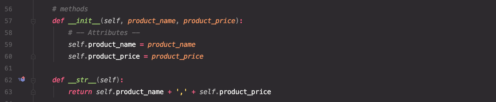

# Using Objects with Classes

## Introduction
In this module, we built on what we learned previously about classes and started to create objects from classes. At first objects seem like a lot of lines of code to do things we already know. But they are a powerful way to separate concerns and make future changes less painful.
### False starts
This was a very difficult concept for me. I could see the various pieces but really wasn't understanding how they fit together, and more importantly why.

I restarted this project three or four times, and had trouble even after watching the module review video. Ultimately, the way I was able to move forward was to start out by ignoring the objects part of the rubric, and then refactor to work the objects in.
### Refactoring for objects
First, using the starter file, I got the desired functionality working without the objects. These were all tasks we had done before––read file, add items, review items, write file, a simple menu. I stored the product and price in a variable.

In the FileProcessor class, I was reading out lists from the file.

This was the first place I wanted to start using the Product class, so I filled in the init and str methods. Now I could start using objects to store and manipulate data.

In the new version of FileProcessor.read_data_from_file, I could eliminate the list_row variable and replace it with a Product object.

The next area to simplify was IO.print_current_products_in_list. 

Now that my rows were Product objects, the print statement could be very simple. (More on that later.)

IO.input_new_product_and_price got simpler as well.

And that made menu choice two half as long. (I was getting an error at this stage, which I later fixed when I added exception handling.)

After all that simplification, menu option 1 to review data didn't look as good as it used to. I lost all my spacing and formatting with the dollar sign. And I definitely didn't want that formatting cruft back in my nice csv data file. So I decided to try adding a method to make things pretty for display.

While I'm not sure that's a perfect separation of concerns, I'm pleased with how it satisfied my desire for human-readable text and machine-readable data.

Once everything seemed to be working, I reviewed the getter/setter properties––I had created them in early attempts but because I wasn't using the class successfully, I wasn't able to get the exceptions to fire. With the class working properly, it was time to set up some validation. 

In the process, I also realized that there was no reason to have two separate variables storing IO.input_new_product_and_price, and that's why I was erroring out when I tried to enter more than two new items.

The final version of the main body of the script was much more concise.

I made a few cosmetic tweaks, and everything worked as expected (Figures 14-16).

## Conclusion
I started this script with a superficial understanding of using class objects. It turns out that during my first several tries, I had created the class well, I just didn't get how to use it. By the time I figured out how to use it to transform data presentation, it really started to make sense and I could start to see how it streamlined the main body of the script and would make global changes easier.